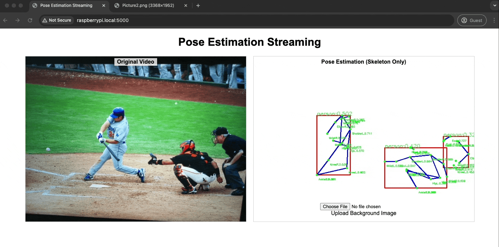

# Raspberry Pi AI Camera Pose Estimation with Docker

## Overview
This example contains a Dockerized Flask application that streams video from a Raspberry Pi AI Camera and performs real-time pose estimation, ensuring user privacy by displaying only skeletal information on a neutral background. 
This approach is ideal for monitoring elderly individuals or other privacy-sensitive environments.



## Installation

1. **Clone the Repository:**

   ```bash
   git clone https://github.com/SonySemiconductorSolutions/aitrios-rpi-sandbox.git
   cd aitrios-rpi-sandbox/examples/docker_pose_estimation
   ```

2. **Install Docker software**

   ```bash
   ./install_docker
   ```

3. **Build and Run with Docker Compose:**

   This example includes a `Dockerfile` and a `docker-compose.yml` configured for this application. To build and start the container, run:

   ```bash
   docker-compose up --build
   ```

   This will build the Docker image and start the Flask application on port `5000`.

## Usage

- **Web Interface:**  
  Open your web browser:  
  `http://<your_rpi_ip>:5000/`

## Docker Cleanup

To completely reset your Docker environment, run the following command:

```bash
docker-compose down --rmi all --volumes --remove-orphans
```

## Troubleshooting

- **Camera Access Issues:**  
  Ensure that the Raspberry Pi AI Camera is enabled and connected correctly.

- **Model or Detection Errors:**  
  Check the container logs for error messages related to model loading or pose estimation, and adjust thresholds or model paths as necessary.

