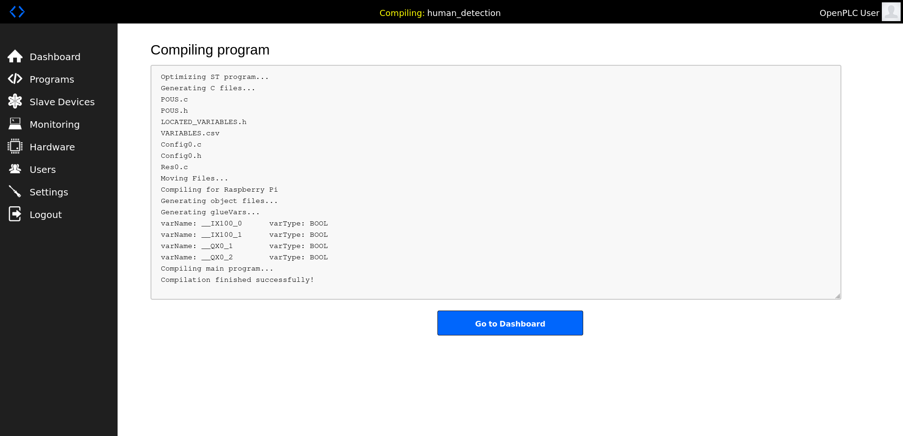

# Human Detection Alert Sysyem
## Overview
This example containts human detection notification system with RaspberryPi AI Camera + OpenPLC + LED Lights


## Required equipment list

|    |  Item  |  Required  |  Notes  |
| ---- | ---- | ---- | ---- |
|  1  |  Raspberry Pi AI Camera  |  *  |  Purchase link available [here](https://www.raspberrypi.com/products/ai-camera/)  |
|  2  |  Raspberry Pi × 2  |  *  | This sample uses one Raspberry Pi 4 and one Raspberry Pi 5. OpenPLC requires Raspberry Pi 4 or earlier models. Compatible Raspberry Pi models for AI Camera can be found [here](https://www.raspberrypi.com/documentation/accessories/ai-camera.html#prerequisites)  |
|  3  |  Type-C Cable  |  *  | For power supply  |
|  4  |  Micro SD Card  |  *  | 32GB or larger recommended  |
|  5  |  Mouse  |    | Only if needed for development  |
|  6  |  Monitor  |    | Only if needed  |
|  7  |  Keyboard  |    | Only if needed  |
|  8  |  HDMI Cable  |    | Only if needed  |
|  9  |  LED Light  |    | Only if needed  |
|  10  |  Switching Power Supply  |    | Only if needed  |
|  11  |  Relay Circuit  |    | Only if needed  |
|  12  |  GPIO Pin  |    | Only if needed  |
|  13  |  Heat Sink & Case  |    | Only if needed  |

## Installation
1. Clone the Repository:
   
   ```bash
   git clone https://github.com/SonySemiconductorSolutions/aitrios-rpi-sandbox.git
   cd aitrios-rpi-sandbox/examples/plc_human_detection
   ```
2. Install Pymodbus library for Modbus communication
   ```bash
   sudo pip install pymodbus==2.5.3
   ```
   **Note:** Port 502 used for Modbus communication is a privileged port. Please run with administrator privileges.

3. Install OpenPLC Editor and Runtime on other Raspberry Pi
   
   Please visit OpenPLC Official site
   - [OpenPLC Editor](https://autonomylogic.com/docs/installing-openplc-editor/)
   - [OpenPLC Runtime](https://autonomylogic.com/docs/installing-openplc-runtime-on-linux-systems/)
   
   **Note:** OpenPLC Runtime is not compatible with RaspberryPi 5. Please refer to the [official compatibility devices](https://autonomylogic.com/docs/2-4-physical-addressing/).
   
## Create .st file
Create a Structured Text (.st) program for PLC control.

1. Create the following Ladder Program using OpenPLC Editor


2. Create .st file
   
   compile laddder program to .st file

## Setup OpenPLC Runtime
1. Start OpenPLC Runtime and Open your web browser
   
   ```
   http://<Raspberry Pi IP address>:8080
   ```     

2. Login OpenPLC Runtime
   - username : openplc
   - password : openplc

    

3. Select `Hardware` tab and select `Raspberry Pi` for OpenPLC Hardware Layer


4. Select `Programs` tab and upload the .st file

    
    After upload program, compilation will start automatically

    

   
5. Select `Slave Devices` tab and setup slave devices

**Note:** Enter the IP address of the slave device in the `IP Address` field.

## Usage
1. Select `Start OpenPLC` on OpenPLC Runtime

   
2. Start Raspberry Pi AI Camera Application 
    ```bash
    sudo python app.py
    ```

## Expected Results
### Wiring Diagram


### Status Indicators
| Status | Green LED | Red LED |
|--------|-----------|---------|
| No Person Detected | ON | OFF |
| Person Detected | OFF | ON |

### Monitoring tab
You can check the results on the `Monitoring` tab in OpenPLC Runtime
- No Person Detected

- Person Detected
